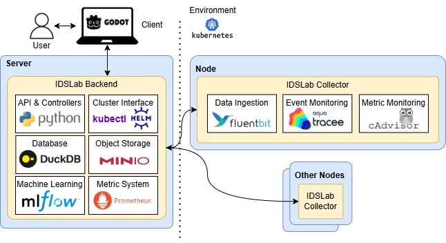
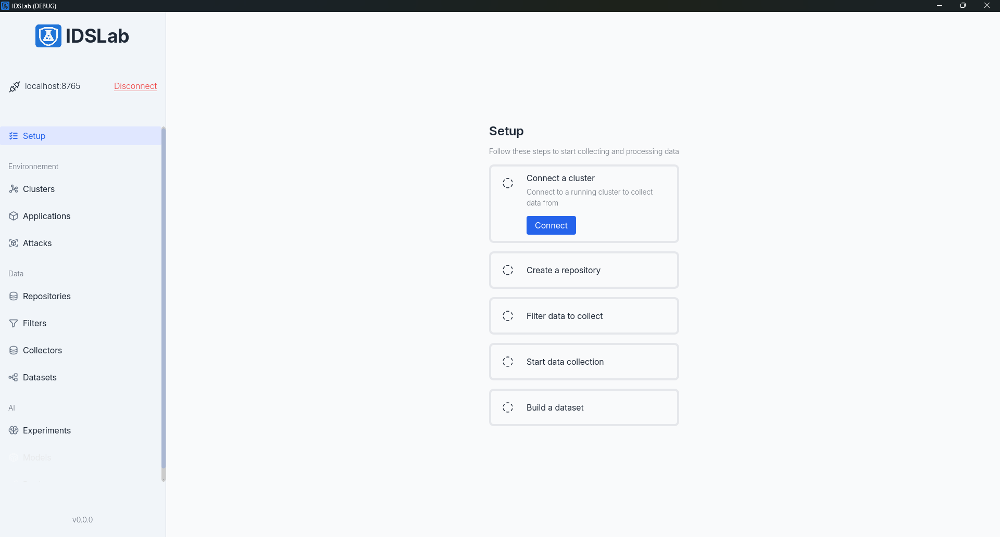
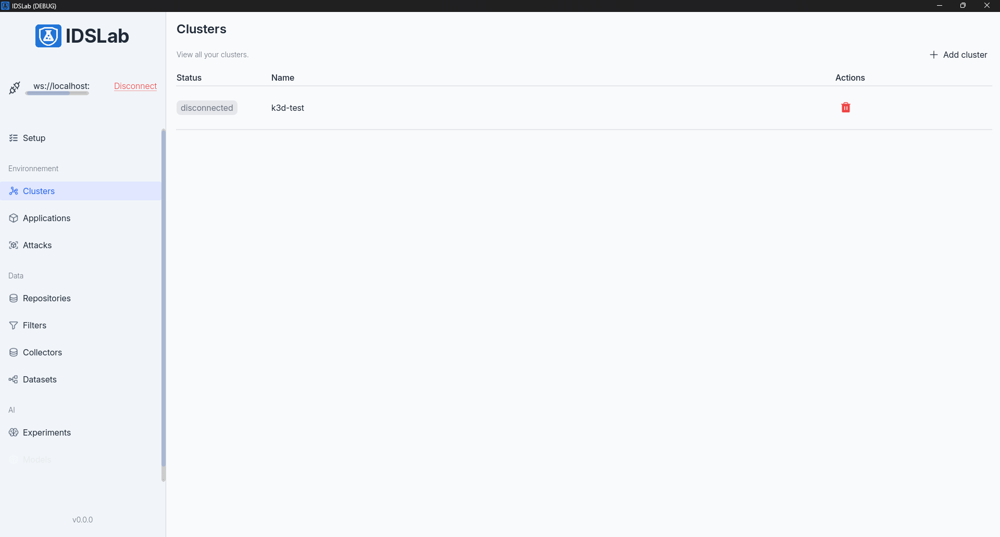
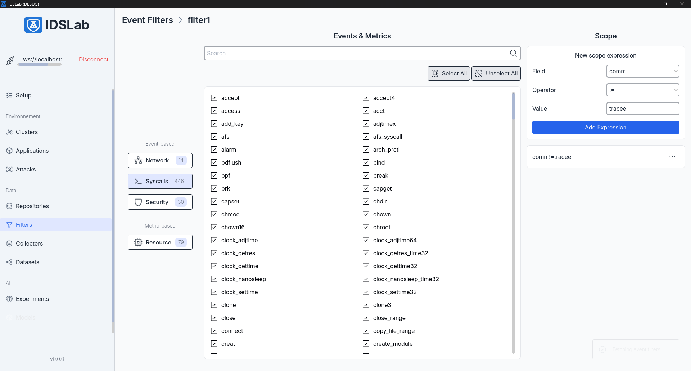
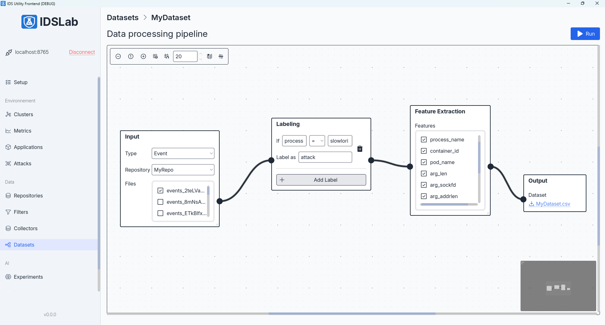

# IDSLab

## Overview
- IDSLab is a sandbox for ML-based intrusion detection, combining Kubernetes runtime collection (Tracee + Fluent Bit + Prom scraper), MinIO object storage, and a dataset graph builder that exports features to CSV for downstream modeling. IDSLab is in active developement.
- Web UI (Godot) speaks to a Python WebSocket backend that orchestrates collectors, repositories, and dataset execution.
- Architecture: 
- Sample data: [Tracee event JSONL that the collectors emit](https://kaggle.com/datasets/deacafbe9bef40e508fd655dc31672507cc4b4a6ccbf43b98447f970ee62e980)

## Installation
### Docker Compose
- Requirements: Docker and Docker Compose.
- From the repo root: `docker compose up --build`
- Local access after startup:
  - UI: http://localhost:8080
  - MinIO console: http://localhost:9001 (minioadmin/minioadmin)

## Screenshots
| Setup | Cluster view |
| --- | --- |
|  |  |

| Data filters | Dataset builder |
| --- | --- |
|  |  |
